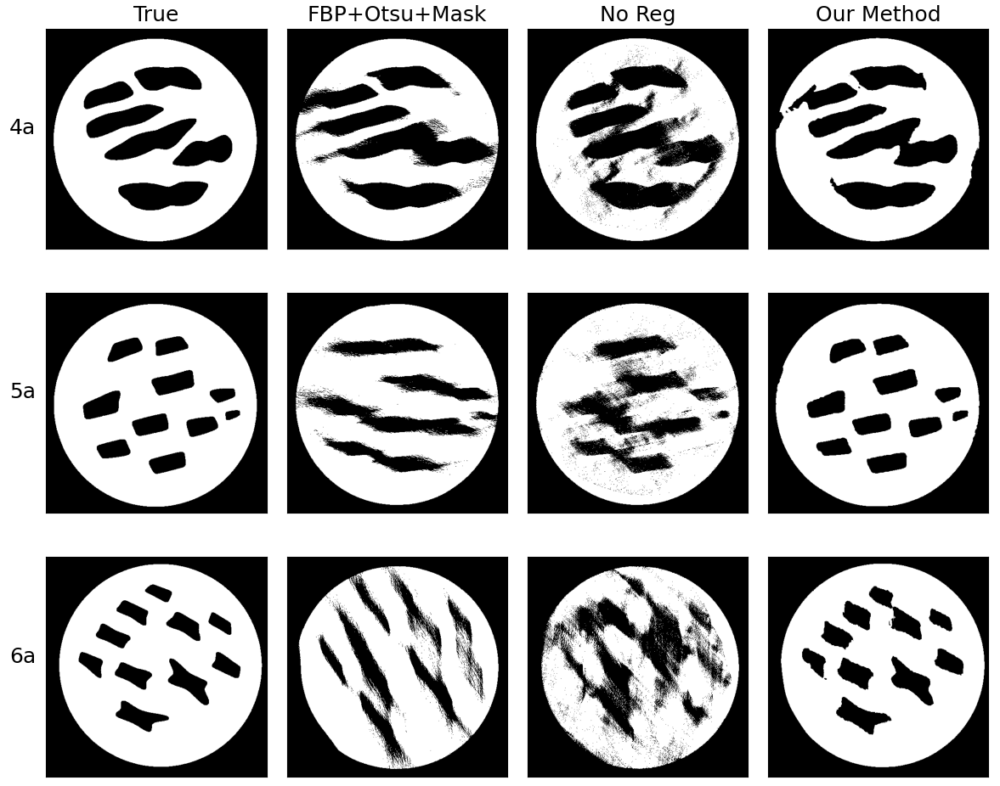
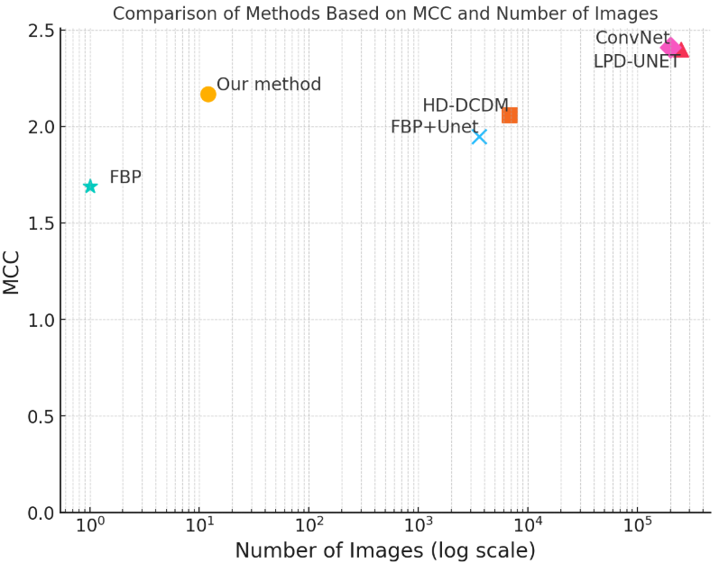

# 🌀 Data-Efficient Limited-Angle CT Using Deep Priors and Regularization

[](https://arxiv.org/abs/2502.12293)
[](https://www.python.org/)
[](LICENSE)

This repository contains the code for the paper:  
📄 **[Data-Efficient Limited-Angle CT Using Deep Priors and Regularization](https://www.arxiv.org/abs/2502.12293)**

---



## 📝 Abstract

Reconstructing an image from its Radon transform is a fundamental computed tomography (CT) task arising in applications such as X-ray scans. In many practical scenarios, a full 180-degree scan is not feasible, or there is a desire to reduce radiation exposure. In these limited-angle settings, the problem becomes ill-posed, and methods designed for full-view data often leave significant artifacts.

We propose a very low-data approach to reconstruct the original image from its Radon transform under severe angle limitations. Because the inverse problem is ill-posed, we combine multiple regularization methods, including:

- Total Variation  
- A sinogram filter  
- Deep Image Prior  
- A patch-level autoencoder  

We use a differentiable implementation of the Radon transform, which allows us to use gradient-based techniques to solve the inverse problem.

Our method is evaluated on a dataset from the **Helsinki Tomography Challenge 2022**, where the goal is to reconstruct a binary disk from its limited-angle sinogram. We only use **12 data points**—eight for learning a prior and four for hyperparameter selection—and achieve results comparable to the best synthetic data-driven approaches.



---

## 📁 Repository Content

This repository contains scripts for:

- 🧪 **Benchmarking** our method (with chosen hyperparameters), Filtered Back Projection (FBP), and the **HTC'22 winner**  
- 🔍 **Hyperparameter search** for our method  
- 📊 **Analyzing** the hyperparameter search results  
- 🧠 **Training** the PSR model  

---

## ⚙️ Usage

### 🧪 Benchmarking

To benchmark our method, FBP, and the HTC'22 winner, run:

```bash
python benchmark.py <python_file>
```

where `<python_file>` contains a function:

```python
reconstruct(sinogram, angles) -> \hat{Y}
```
This function takes a sinogram and a list of angles and returns the reconstructed image.
**Examples:**

```bash
python benchmark.py reconstruction_algorithms/ours.py
python benchmark.py reconstruction_algorithms/fbp.py
python benchmark.py reconstruction_algorithms/germer.py
```
Benchmarking the Germer method requires downloading the NN weights from https://github.com/99991/HTC2022-TUD-HHU-version-1,
and placing them in `reconstruction_algorithms/model.pth`.

### 🔍 Hyperparameter Search
To perform a hyperparameter search for our method, run:

```bash
python hyperparameter_search.py
```
The script runs **100 trials** of random hyperparameters evaluated on the demo images (**level 8** in `htc_data/`). The results are saved in the `hyperparameters2/` directory.
⚠️ **Note:** This process may take several hours, depending on your hardware.

### 📊 Analyzing Hyperparameter Search Results
To analyze the hyperparameter search results, run:

```bash
python analyze_trials.py
```
This script compiles results from `hyperparameters2/` and identifies the **best hyperparameters** based on the demo images, including ablation study results.
🔹 **Benchmarking the Top-3 hyperparameters** requires manual modification of the path in `reconstruction_algorithms/ours.py`, followed by:

```bash
python benchmark.py reconstruction_algorithms/ours.py
```
### 🧠 Training the PSR Model
To train the PSR model, run:

```bash
python train_psr.py
```
This script trains the model using the best hyperparameters found in the previous step. The trained model is saved in `trained_model/`.
The model is trained on the **synthetic images** located in `generated_data/`.
The trained model will be saved as:
```bash
patch_autoencoder_P<patch_size>_D<patch_size//4>.pt
```
if it doesn't already exist.